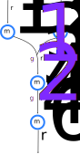

```@meta
EditURL = "3-parameter-estimation.jl"
```

# Parameter estimation using proteomics and flux data

````@example 3-parameter-estimation
using DifferentiableMetabolism
using AbstractFBCModels
using Symbolics
using ConstraintTrees
using COBREXA
using Clarabel
using Tulip
using JSONFBCModels
using CairoMakie

include("../../test/simple_model.jl") #hide
````

prune model for brevity

````@example 3-parameter-estimation
delete!(model.reactions, "r5")
delete!(model.genes, "g4")
delete!(model.genes, "g5")
delete!(model.genes, "g3")
model.reactions["r4"].gene_association_dnf = [["g2"]]
model.reactions["r1"].lower_bound = -1000.0
model.reactions["r2"].lower_bound = -1000.0
````

now models looks like this



````@example 3-parameter-estimation
kcats = Symbolics.@variables r3 r4

reaction_isozymes = Dict(
    "r3" => Dict(
        "isozyme1" => ParameterIsozyme(
            gene_product_stoichiometry = Dict("g1" => 1.0), # assume subunit stoichiometry of 1 for all isozymes
            kcat_forward = r3,
            kcat_reverse = nothing,
        ),
    ),
    "r4" => Dict(
        "isozyme1" => ParameterIsozyme(
            gene_product_stoichiometry = Dict("g2" => 1.0), # assume subunit stoichiometry of 1 for all isozymes
            kcat_forward = r4,
            kcat_reverse = nothing,
        ),
    ),
)

gene_product_molar_masses = Dict("g1" => 20.0, "g2" => 10.0)

Symbolics.@variables capacitylimitation

true_parameter_values = Dict(capacitylimitation => 50.0, r3 => 2.0, r4 => 3.0)

km = build_kinetic_model(
    model;
    reaction_isozymes,
    gene_product_molar_masses,
    capacity = capacitylimitation,
)

sol, _, _, _ = optimized_constraints_with_parameters(
    km,
    true_parameter_values;
    objective = km.objective.value,
    optimizer = Tulip.Optimizer,
)

sol.fluxes
````

create a loss function

````@example 3-parameter-estimation
measured = [
    sol.fluxes.r1,
    sol.fluxes.r3,
    sol.isozyme_forward_amounts.r3.isozyme1,
    sol.isozyme_forward_amounts.r4.isozyme1,
]

km *=
    :loss^ConstraintTrees.Constraint(;
        value = 0.5 * (
            ConstraintTrees.squared(km.fluxes.r1.value - measured[1]) +
            ConstraintTrees.squared(km.fluxes.r3.value - measured[2]) +
            ConstraintTrees.squared(
                km.isozyme_forward_amounts.r3.isozyme1.value - measured[3],
            ) +
            ConstraintTrees.squared(
                km.isozyme_forward_amounts.r4.isozyme1.value - measured[4],
            )
        ),
        bound = nothing,
    )

estimated_parameters = Dict(capacitylimitation => 50.0, r3 => 5.0, r4 => 1.0) # initial values
parameters = [r3, r4] # will differentiate against these two parameters
η = 0.1 # learning rate

losses = Float64[]

for k = 1:150

    sol2, x_vals, eq_dual_vals, ineq_dual_vals = optimized_constraints_with_parameters(
        km,
        estimated_parameters;
        objective = km.loss.value,
        optimizer = Clarabel.Optimizer,
        sense = COBREXA.Minimal,
        modifications = [COBREXA.silence],
    )

    push!(losses, sol2.loss)

    sens, vids = differentiate(
        km,
        km.loss.value,
        x_vals,
        eq_dual_vals,
        ineq_dual_vals,
        estimated_parameters,
        parameters;
    )
    measured_idxs = [1, 3, 11, 12]

    x = [
        sol2.fluxes.r1,
        sol2.fluxes.r3,
        sol2.isozyme_forward_amounts.r3.isozyme1,
        sol2.isozyme_forward_amounts.r4.isozyme1,
    ]

    dL_dx = x - measured # derivative of loss function with respect to optimization variables
    dL_dkcats = sens[measured_idxs, :]' * dL_dx # derivative of loss function with respect to parameters

    estimated_parameters[r3] -= η * dL_dkcats[1]
    estimated_parameters[r4] -= η * dL_dkcats[2]
end

lines(losses; axis = (xlabel = "Iterations", ylabel = "L2 loss"))

estimated_parameters

true_parameter_values
````

---

*This page was generated using [Literate.jl](https://github.com/fredrikekre/Literate.jl).*

